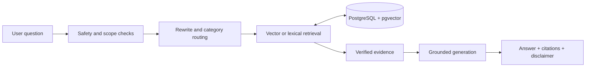

# Creativa Diabetes RAG Assistant

A bilingual English/Arabic assistant that answers diabetes questions from verified medical sources. It retrieves relevant passages from PostgreSQL with `pgvector`, builds a grounded answer, and shows the sources used.

> This project is for research and education. It does not replace medical advice, diagnosis, or emergency care.

## What it does

- Answers diabetes questions in English and Arabic.
- Searches a certified medical document collection before generating an answer.
- Shows the retrieved evidence and source links.
- Supports local or Gemini embeddings.
- Uses Gemini, Groq, or Vercel AI Gateway for generation, with a controlled extractive fallback.
- Blocks unsupported or unsafe requests before generation.
- Records retrieval, generation, quality, latency, and cost metrics.

## How it works



The production web client retrieves and displays evidence first, then generates from those exact stored chunk IDs. The local Gradio app follows the same evidence-first design. See [the system architecture](docs/system-architecture.md) for the full technical flow.

## Quick start

### Requirements

- Python 3.11 or 3.12
- [uv](https://docs.astral.sh/uv/)
- Docker
- A Gemini API key for the default generation route

### 1. Install dependencies

```bash
uv sync --extra local
```

### 2. Create the local environment file

Windows PowerShell:

```powershell
Copy-Item .env.development.example .env.development
```

macOS or Linux:

```bash
cp .env.development.example .env.development
```

Add your `GEMINI_API_KEY` to `.env.development`. Add `GROQ_API_KEY` only if you want Groq as a fallback. Never commit local environment files.

### 3. Start PostgreSQL

```bash
docker compose up -d postgres
```

### 4. Create the vector schema

```bash
uv run python scripts/bootstrap.py
```

### 5. Ingest the medical documents

```bash
uv run python scripts/ingest.py
```

The default source folder is `data/rew_data/books/`. It accepts PDF, DOCX, and TXT files.

### 6. Start the app

```bash
uv run python app.py
```

Open [http://localhost:7860](http://localhost:7860).

For other setups, use:

- [Docker quick start](QUICKSTART_DOCKER.md)
- [Local development guide](QUICKSTART_SYSTEM.md)
- [Vercel and Neon deployment guide](DEPLOYMENT_VERCEL.md)

## Useful commands

```bash
# Run the test suite
uv run python -m pytest

# Check configuration, dependencies, embeddings, database, and UI
uv run python scripts/dry_run.py

# Test real pgvector writes and searches
uv run python scripts/database_smoke.py

# Evaluate retrieval and generated answers
uv run python scripts/evaluate.py

# Evaluate retrieval without calling a generation model
uv run python scripts/evaluate.py --no-generate
```

To replace an existing document during ingestion, use:

```bash
uv run python scripts/ingest.py --force
```

## Main folders

| Path | Purpose |
|---|---|
| `app.py` | Local Gradio interface and shared answer pipeline |
| `backend/` | FastAPI server and production web client |
| `src/` | Retrieval, generation, safety, citations, metrics, and configuration |
| `src/ingestion/` | Parsing, classification, chunking, filtering, and indexing |
| `scripts/` | Setup, ingestion, evaluation, and verification commands |
| `database/` | PostgreSQL and pgvector schemas |
| `tests/` | Automated tests |
| `data/rew_data/books/` | Default medical document collection |
| `docs/` | Detailed project documentation |

## Important configuration

| Variable | Default | Purpose |
|---|---|---|
| `DATABASE_URL` | Local Compose database | PostgreSQL connection |
| `EMBEDDING_PROVIDER` | `local` | `local` or `gemini` embeddings |
| `EMBEDDING_DIMENSION` | `384` | Vector dimension for the active index |
| `GENERATION_PROVIDER` | `auto` | Automatic or fixed answer provider |
| `GENERATION_PRIMARY_PROVIDER` | `gemini` | First provider in automatic mode |
| `GENERATION_FALLBACK_PROVIDER` | `groq` | Second provider in automatic mode |
| `TOP_K` | `5` | Maximum evidence chunks |
| `SIMILARITY_THRESHOLD` | `0.30` | Minimum retrieval score |
| `DATA_DIR` | `data/rew_data/books` | Source document folder |
| `DEBUG` | `false` | Show detailed retrieval diagnostics |

The application stores different embedding providers and dimensions in separate database namespaces and table families. Re-ingest the documents whenever you switch to a new embedding space.

## Safety

The assistant checks each question before retrieval. Emergency, high-risk, unsupported, and insufficient-evidence requests can stop before any generation provider is called. Accepted answers are grounded in certified sources and include a medical disclaimer.

The safety rules are keyword- and policy-based guardrails, not a clinical diagnostic system.
