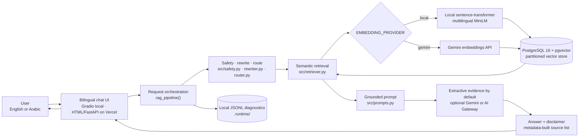
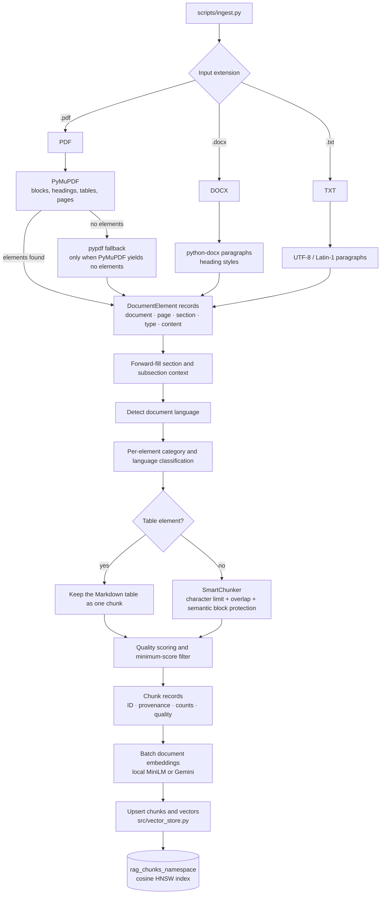
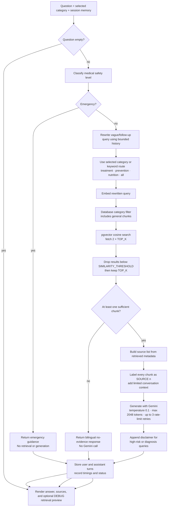
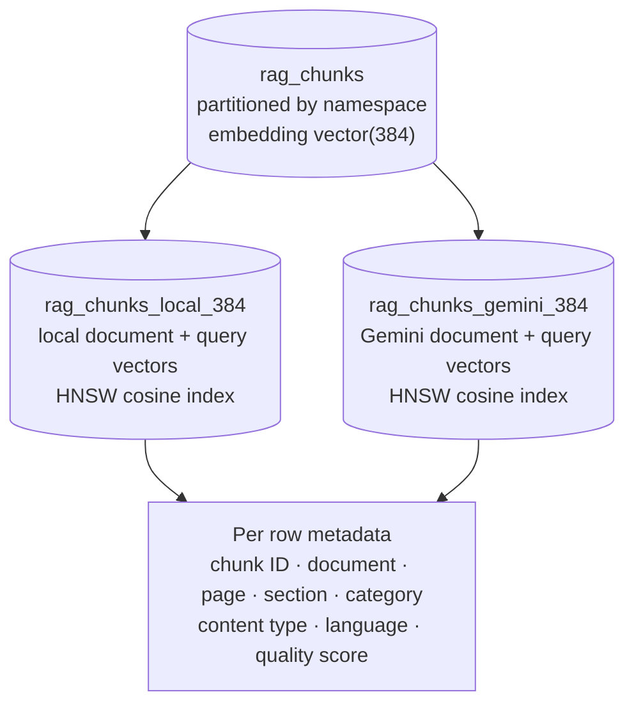
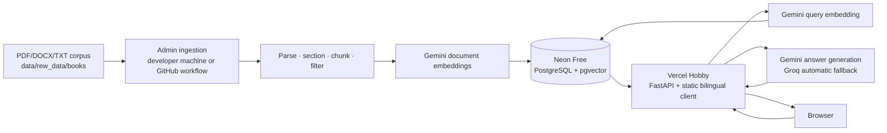

# Diabetes RAG Assistant

A bilingual English/Arabic RAG application that answers diabetes questions from the medical documents in this repository. It supports local sentence-transformer embeddings for development and Gemini API embeddings for serverless deployment. PostgreSQL with pgvector stores and searches all embeddings.

> This is a research and educational tool, not a substitute for professional medical advice.

## Architecture as implemented

These diagrams follow the active code paths in `app.py`, `src/`, `scripts/`, and
`database/schema.sql`. They intentionally use no fixed colors or backgrounds so
GitHub can render them transparently in both light and dark themes.

### Running system and external boundaries



The embedding provider is selected once from configuration. Consecutive PDF
blocks are first aggregated into page-scoped semantic units so citations remain
exact while tiny layout fragments do not become weak standalone embeddings.
Document and query
vectors therefore use the same provider and dimension. Gemini is always used for
answer generation; choosing local embeddings does not make generation local.

### Document ingestion and index construction



`--force` does not delete the stored version until parsing, chunking, and
embedding of the replacement have succeeded. Storage is then replaced at the
document level. Tables deliberately bypass normal splitting.

### Question processing and decision branches



Citations are built from retrieved metadata, not parsed from the model's text.
The active UI shows the final answer and source list after the request completes;
when `DEBUG=true`, it also shows scores and text previews. It does not currently
pause generation for a separate pre-generation evidence-approval step.

### Vector namespace isolation



The namespace defaults to `<provider>_<dimension>` and can be overridden with
`EMBEDDING_NAMESPACE`. Separate partitions prevent accidental similarity
comparisons between the default local and Gemini embedding spaces.

## Active code versus supporting code

| Path | Actual role |
|---|---|
| `app.py` | Local Gradio UI and shared synchronous RAG request orchestration. |
| `backend/server.py`, `backend/static/index.html` | Stateless Vercel API and bilingual production web client. |
| `src/ingestion/` | Active parser, section propagation, classification, chunking adapter, and filters used by `scripts/ingest.py`. |
| `src/embeddings.py`, `src/vector_store.py`, `src/retriever.py` | Active embedding, pgvector storage, and query path. |
| `src/prompts.py`, `src/generator.py`, `src/citations.py` | Active grounded generation and source presentation. |
| `src/observability.py` | Active local request traces and the three-query developer benchmark stored under `.runtime/`. |
| `chunking/` | Standalone earlier JSON chunking workflow; its output files are not read by the active pgvector pipeline. |
| `example/services/` | Prototype/example components and security tests; the Gradio application does not import them. |
| `src/context_builder.py` | Available helper, but the active request path constructs context directly in `src/prompts.py`. |

## Main modules

```text
app.py                      Local Gradio UI and shared RAG request orchestration
backend/server.py           Stateless Vercel API entrypoint
backend/static/index.html   Dependency-free production chat client
compose.yaml                PostgreSQL + CPU-only Gradio application services
database/schema.sql         Partitioned pgvector schema
pyproject.toml              UV dependency and pytest configuration
uv.lock                     Reproducible dependency lock

scripts/
  bootstrap.py              Create/verify the configured vector namespace
  dry_run.py                Validate modules, embeddings, database, and UI
  ingest.py                 Parse, embed, and store source documents
  evaluate.py               Rule-based retrieval/response evaluation cases
  database_smoke.py         Real pgvector insert/search/delete smoke test
  system_consistency.py     Running database, retrieval, UI, and optional live checks

src/
  config.py                 Environment-based configuration
  embeddings.py             Local/Gemini embedding providers
  vector_store.py           PostgreSQL partitions and cosine search
  retriever.py              Thresholded, category-aware result mapping
  safety.py                 Medical-risk classification and disclaimers
  rewriter.py / router.py   Follow-up contextualization and category routing
  prompts.py / generator.py Grounded Gemini prompt and generation client
  citations.py              Metadata-derived citations and debug output
  memory.py                 Bounded per-session conversation memory
  observability.py          Local request timings and benchmark history
  ingestion/                Active parsing, classification, chunking, and filtering

tests/                      Unit and integration-style pytest suite
data/rew_data/books/        Default source-document directory
```

## Requirements

- Python 3.11 or 3.12
- [UV](https://docs.astral.sh/uv/)
- PostgreSQL with the pgvector extension
- A Gemini API key for generation and online embeddings

## Quickstarts

- [Docker end to end](QUICKSTART_DOCKER.md): run PostgreSQL, pgvector, local CPU
  embeddings, Gemini generation, and Gradio with Docker Compose.
- [Local development](QUICKSTART_SYSTEM.md): run PostgreSQL in Docker and the
  Python/Gradio application on the host for faster editing and debugging.
- [Vercel + Neon deployment](DEPLOYMENT_VERCEL.md): deploy the ASGI application
  without Docker and rebuild the hosted pgvector index from the full PDF corpus.

## Local setup

Install the locked dependencies including the local embedding model runtime:

```bash
uv sync --extra local
```

Create local configuration:

```powershell
Copy-Item .env.development.example .env.development
```

On macOS/Linux:

```bash
cp .env.development.example .env.development
```

Set `GEMINI_API_KEY` in `.env.development`. Local secret files are ignored by
Git and must never be committed.

Start PostgreSQL with pgvector:

```bash
docker compose up -d postgres
```

Download the local embedding model and create its database partition/index:

```bash
uv run python scripts/bootstrap.py
```

## Online embeddings

For API-based embeddings, set:

```dotenv
EMBEDDING_PROVIDER=gemini
ONLINE_EMBEDDING_MODEL=gemini-embedding-2
EMBEDDING_DIMENSION=384
```

The serverless environment does not need the local model extra:

```bash
uv sync
uv run python scripts/bootstrap.py --verify-online
```

The online provider adds retrieval instructions to document and query inputs, requests 384-dimensional vectors, and normalizes the returned vectors before pgvector storage.

Changing providers selects a separate database namespace. Run ingestion once for each provider you intend to use.

## Tests and consistency checks

Run pytest:

```bash
uv run python -m pytest
```

The default test command runs in parallel, randomizes test order, reports
failures immediately, applies per-test timeouts, and enforces 100% statement
and branch coverage for the measured chunking and security modules. The suite
uses `pytest-instafail`; `pytest-installfail` is not a published package.

Run the integration dry run:

```bash
uv run python scripts/dry_run.py
```

With Gradio running, verify the configured model, pgvector data, deterministic
retrieval invariants, Gradio APIs, and one live Gemini request:

```powershell
.\scripts\test_system.ps1
```

On macOS/Linux, use `./scripts/test_system.sh`. To skip the billable Gemini
request, run `uv run python scripts/system_consistency.py` directly.

Exercise real pgvector writes, nearest-neighbor search, and cleanup:

```bash
uv run python scripts/database_smoke.py
```

The dry run validates:

- Required files and environment keys
- Runtime library imports
- Routing, rewriting, safety, classification, and chunking
- Active local or Gemini embeddings
- PostgreSQL connectivity and pgvector availability
- The active namespace and cosine query path
- Gradio UI construction

It does not ingest documents or call Gemini generation. When `EMBEDDING_PROVIDER=gemini`, it does make embedding API requests.

## Ingest documents

Place PDF, DOCX, or TXT files in `data/rew_data/books/`, then run:

```bash
uv run python scripts/ingest.py
```

Options:

```text
--data-dir PATH    Use another document directory
--file PATH        Ingest one document
--force            Replace an already-ingested document
--reset            Delete chunks in the active embedding namespace
--stats            Print category counts without ingesting
--verbose, -v      Enable debug logging
```

Without `--force`, an existing document is skipped. With `--force`, old chunks are removed only after parsing, chunking, and embedding succeed.

## Run the application

```bash
uv run python app.py
```

Open [http://localhost:7860](http://localhost:7860).

## Evaluation

```bash
# Full retrieval and generation evaluation
uv run python scripts/evaluate.py

# Retrieval only; no Gemini generation
uv run python scripts/evaluate.py --no-generate

# One category
uv run python scripts/evaluate.py --category nutrition
```

## Configuration

| Variable | Default | Purpose |
|---|---|---|
| `DATABASE_URL` | local Compose URL | PostgreSQL connection URL |
| `DATABASE_URL_UNPOOLED` | empty | Direct Neon URL used for schema operations |
| `APP_ENV` | `development` | Selects `.env.development` or deployment behavior |
| `AUTO_CREATE_SCHEMA` | environment-dependent | Create schema on demand locally; disabled in deployment |
| `EMBEDDING_PROVIDER` | `local` | `local` or `gemini` |
| `EMBEDDING_MODEL` | multilingual MiniLM | Local sentence-transformer |
| `ONLINE_EMBEDDING_MODEL` | `gemini-embedding-2` | Hosted embedding model |
| `EMBEDDING_DIMENSION` | `384` | Shared pgvector dimension |
| `EMBEDDING_NAMESPACE` | provider-derived | Optional database partition namespace |
| `GEMINI_API_KEY` | empty | Hosted embeddings and optional direct local generation |
| `GENERATION_PROVIDER` | `auto` | `gemini`, `groq`, `vercel_gateway`, `extractive`, or automatic routing |
| `GENERATION_PRIMARY_PROVIDER` | `gemini` | First provider when automatic routing is enabled |
| `GENERATION_FALLBACK_PROVIDER` | blank | Fallback provider when automatic routing is enabled |
| `GEMINI_MODEL` | `gemini-2.5-flash` | Optional direct generation model |
| `GROQ_API_KEY` | empty | Groq generation credential |
| `GROQ_MODEL` | `openai/gpt-oss-120b` | Groq OpenAI-compatible generation model |
| `AI_GATEWAY_MODEL` | `google/gemini-2.5-flash` | Vercel AI Gateway production model |
| `ONLINE_EMBEDDING_BATCH_SIZE` | `16` | Maximum documents per Gemini embedding request |
| `ONLINE_EMBEDDING_RPM` | `90` | Rolling embedded-item cap with free-tier headroom |
| `OCR_LANGUAGE` / `OCR_DPI` | `eng` / `150` | Local Tesseract fallback for image-only PDFs |
| `TOP_K` | `5` | Final retrieved chunks |
| `SIMILARITY_THRESHOLD` | `0.30` | Minimum cosine similarity |
| `CHUNK_SIZE` | `2000` | Maximum chunk characters |
| `CHUNK_OVERLAP` | `200` | Adjacent chunk overlap |
| `DATA_DIR` | `data/rew_data/books` | Source documents |
| `DEBUG` | `false` | Show retrieval diagnostics |
| `MAX_MEMORY_TURNS` | `6` | Conversation turns retained |

## Vercel + Neon deployment

The deployment is deliberately split into a request runtime and an admin
ingestion job. Excluding PDFs from the Vercel bundle does **not** remove parsing
or ingestion—the complete corpus remains in Git and is processed into Neon.



Vercel uses `backend/server.py`, Fluid Compute, the Frankfurt function region,
Gemini embeddings, Gemini primary generation with a Groq fallback, and a pooled
Neon connection. Browser-owned bounded history keeps `/api/chat` stateless. The
active answer provider and model are displayed in the frontend and returned by
the API. The raw corpus and local Torch runtime are omitted only from the
serverless function bundle. See
[DEPLOYMENT_VERCEL.md](DEPLOYMENT_VERCEL.md) for provisioning, environment,
ingestion, deployment, and rollback instructions.

Production ingestion uses 3,000-character chunks with 300-character overlap.
The measured 12-document corpus is 946 page-grounded chunks, leaving headroom
under Gemini Embedding 2's 1,000-item daily free-tier quota. Development keeps
the 2,000/200 defaults for local experiments.

## Safety

The pre-generation safety layer classifies queries as emergency, high-risk, diagnosis, or informational. Emergency questions bypass retrieval and generation. High-risk and diagnosis questions receive mandatory disclaimers.

This keyword-based guardrail is not a clinical diagnostic system.
