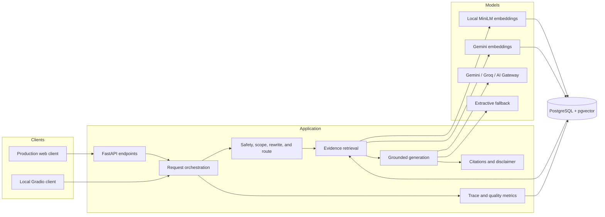
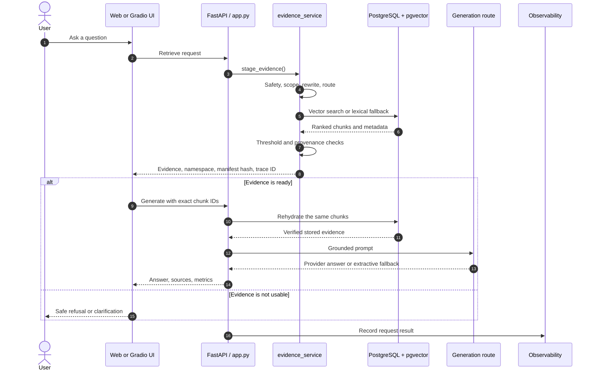
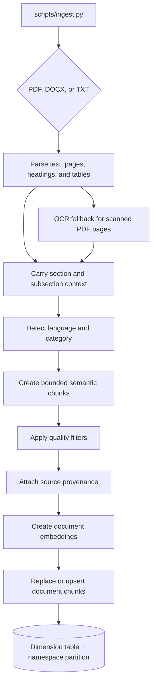
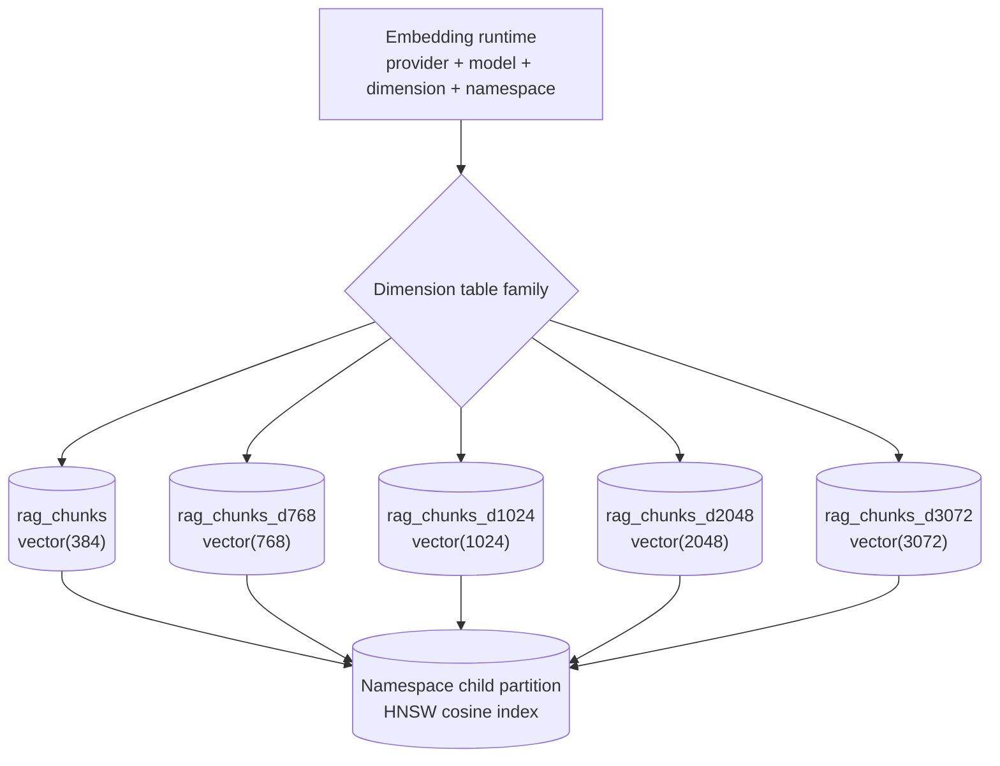

# Creativa Diabetes RAG Assistant: System Architecture

This document describes the architecture implemented by the current codebase. The root [README](../README.md) is the short setup guide; this document is the technical reference.

## 1. System overview

The application has two user interfaces:

- A local Gradio interface in [`app.py`](../app.py).
- A production HTML/JavaScript client served by FastAPI from [`backend/server.py`](../backend/server.py).

Both interfaces use the same evidence-first RAG pipeline.



The main design rule is simple: generation may use only evidence retrieved from the indexed, certified document collection.

## 2. Request lifecycle

### 2.1 Staged evidence flow

The production client normally makes two API calls:

1. `POST /api/retrieve` finds and displays evidence.
2. `POST /api/generate` generates from the exact returned chunk IDs.

The client starts the second call automatically after rendering the evidence; it does not wait for manual approval. The one-call `POST /api/chat` endpoint remains available and runs both stages on the server.



### 2.2 Evidence staging

[`src/evidence_service.py`](../src/evidence_service.py) performs these steps:

1. Reject an empty question.
2. Apply emergency, high-risk, scope, and clarification policies.
3. Verify that the selected deployment index has a valid manifest.
4. Rewrite follow-up questions with bounded conversation history.
5. Route the question to treatment, prevention, nutrition, or all categories.
6. Retrieve up to `TOP_K` chunks.
7. Remove weak, indirect, bibliography-only, or uncertified results.
8. Return an immutable evidence envelope.

Certified evidence must include a source ID and an HTTPS source URL. If the remaining evidence is insufficient, the system returns a safe response without calling a generation provider.

### 2.3 Evidence rehydration

The generate request sends IDs, not editable evidence text. Before generation, the server:

- Checks the embedding dimension and namespace.
- Checks that the active index manifest has not changed.
- Loads the requested chunks again from PostgreSQL.
- Rejects missing or uncertified chunks.

This prevents the browser from changing evidence between retrieval and generation.

### 2.4 Answer generation

[`app.py`](../app.py) builds the prompt from the verified envelope. [`src/generator.py`](../src/generator.py) tries the configured provider route. If all permitted remote providers fail for a recoverable reason, [`src/extractive.py`](../src/extractive.py) builds a controlled answer directly from the evidence.

After generation, the application:

- Normalizes inline citation markers.
- Builds a source list from stored metadata.
- Adds the appropriate medical disclaimer.
- Records provider attempts, timings, tokens, quality metrics, and status.

## 3. Document ingestion

Ingestion is an offline or administrative operation. It is not performed inside a normal user request.



Important ingestion behavior:

- PDF citations keep page-level provenance.
- Tables are kept together when possible so rows are not separated from their headers.
- Low-quality OCR and layout fragments are filtered.
- Document and query embeddings use the same provider, model, dimension, and namespace.
- With `--force`, replacement chunks are prepared before the previous stored version is removed.
- Index manifests record the expected certified corpus and runtime profile.

The main implementation is in [`src/ingestion/`](../src/ingestion/) and [`scripts/ingest.py`](../scripts/ingest.py).

## 4. Vector storage

The project supports these vector dimensions:

| Dimension | Parent table |
|---:|---|
| 384 | `rag_chunks` |
| 768 | `rag_chunks_d768` |
| 1024 | `rag_chunks_d1024` |
| 2048 | `rag_chunks_d2048` |
| 3072 | `rag_chunks_d3072` |

Each parent table is partitioned by `namespace`. A namespace identifies one embedding space, normally from its provider and dimension unless configuration selects a specific active index. Runtime-created child partitions have HNSW cosine indexes.



Every chunk stores its text plus document name, page, section, category, language, quality score, source ID, source URL, and timestamps. The primary key is `(namespace, chunk_id)`.

### Operational tables

| Table | Purpose |
|---|---|
| `rag_metric_events` | Request traces, timings, tokens, costs, and metric payloads |
| `rag_embedding_runs` | Ingestion run state and checkpoints |
| `rag_embedding_events` | Embedding reservations, usage, retries, and errors |

PostgreSQL is authoritative for metrics when it is available. Local JSON files under `.runtime/` provide a development and failure fallback.

## 5. Retrieval and provider fallback

### Embeddings and retrieval

[`src/embeddings.py`](../src/embeddings.py) supports:

- Local multilingual sentence-transformer embeddings.
- Gemini API embeddings.

[`src/retriever.py`](../src/retriever.py) normally performs a cosine search through [`src/vector_store.py`](../src/vector_store.py). If query embedding fails, it can use PostgreSQL lexical search over the same stored corpus. Both routes apply category, score, reference-section, direct-match, and provenance checks.

### Generation

Generation behavior is controlled by:

- `GENERATION_PROVIDER`
- `GENERATION_PRIMARY_PROVIDER`
- `GENERATION_FALLBACK_PROVIDER`

Automatic mode uses the configured primary and fallback providers. Supported remote routes are Gemini, Groq, and Vercel AI Gateway. Extractive generation is the final controlled fallback and can also be selected directly.

Safety blocks and invalid provider requests do not silently fail over into a normal generated answer.

## 6. Main components

| Component | Responsibility |
|---|---|
| [`app.py`](../app.py) | Shared orchestration and local Gradio UI |
| [`backend/server.py`](../backend/server.py) | FastAPI endpoints and static production client |
| [`src/evidence_service.py`](../src/evidence_service.py) | Evidence staging and exact-ID rehydration |
| [`src/safety.py`](../src/safety.py) | Medical-risk classification and response text |
| [`src/rewriter.py`](../src/rewriter.py) | Follow-up rewriting and bilingual retrieval hints |
| [`src/router.py`](../src/router.py) | Category routing |
| [`src/embeddings.py`](../src/embeddings.py) | Local and hosted embedding providers |
| [`src/vector_store.py`](../src/vector_store.py) | Schema, partitions, vector search, and lexical search |
| [`src/retriever.py`](../src/retriever.py) | Retrieval filtering and result mapping |
| [`src/prompts.py`](../src/prompts.py) | Grounded prompt construction |
| [`src/generator.py`](../src/generator.py) | Remote generation provider routing |
| [`src/extractive.py`](../src/extractive.py) | Deterministic evidence fallback |
| [`src/citations.py`](../src/citations.py) | Inline citations and source presentation |
| [`src/observability.py`](../src/observability.py) | Request traces and metrics persistence |
| [`src/embedding_profiles.py`](../src/embedding_profiles.py) | Multi-dimension runtime selection |
| [`src/embedding_quota.py`](../src/embedding_quota.py) | Hosted embedding quota tracking |

## 7. Deployment boundary

The Vercel deployment contains the FastAPI application and static client. Neon hosts PostgreSQL and `pgvector`. Corpus ingestion runs as a separate administrative job from a developer machine or automation with the required credentials.

This separation keeps large source files, parsing libraries, and local embedding runtimes out of normal serverless requests. See [the deployment guide](../DEPLOYMENT_VERCEL.md) for the required workflow.

## 8. Verification

Use the project commands that match the layer being checked:

```bash
# Unit and integration-style tests
uv run python -m pytest

# Configuration, imports, database, embedding, and UI checks
uv run python scripts/dry_run.py

# Real pgvector insert, search, and cleanup
uv run python scripts/database_smoke.py

# Retrieval and answer evaluation
uv run python scripts/evaluate.py
```

## 9. Safety and trust boundaries

The system reduces risk through several independent checks:

- Emergency and unsupported questions can bypass retrieval and generation.
- Generation requires sufficient certified evidence.
- Browser-supplied evidence text is never trusted.
- Vector spaces are separated by dimension and namespace.
- Citations are built from database metadata rather than invented model text.
- Provider failures are recorded and use controlled fallback behavior.
- Every accepted answer includes a medical disclaimer.

These controls improve grounding and traceability, but they do not turn the application into a medical device or diagnostic system.
