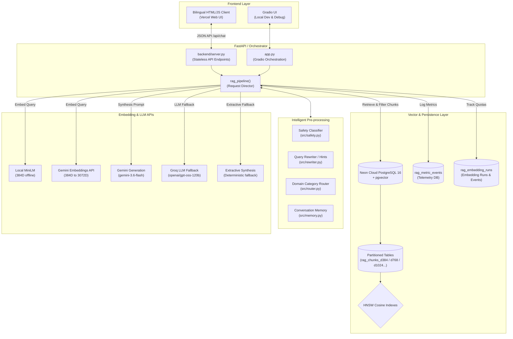
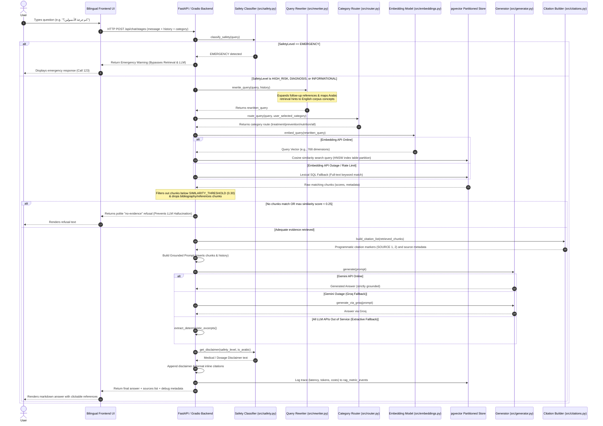
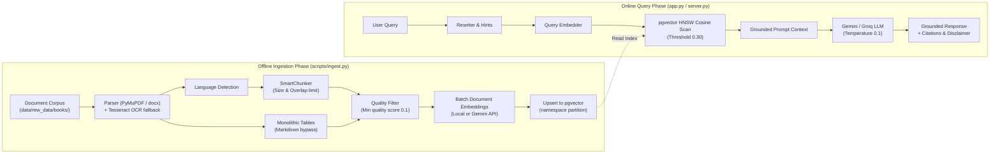
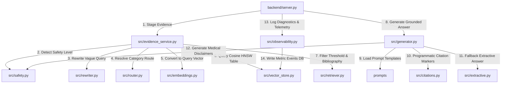
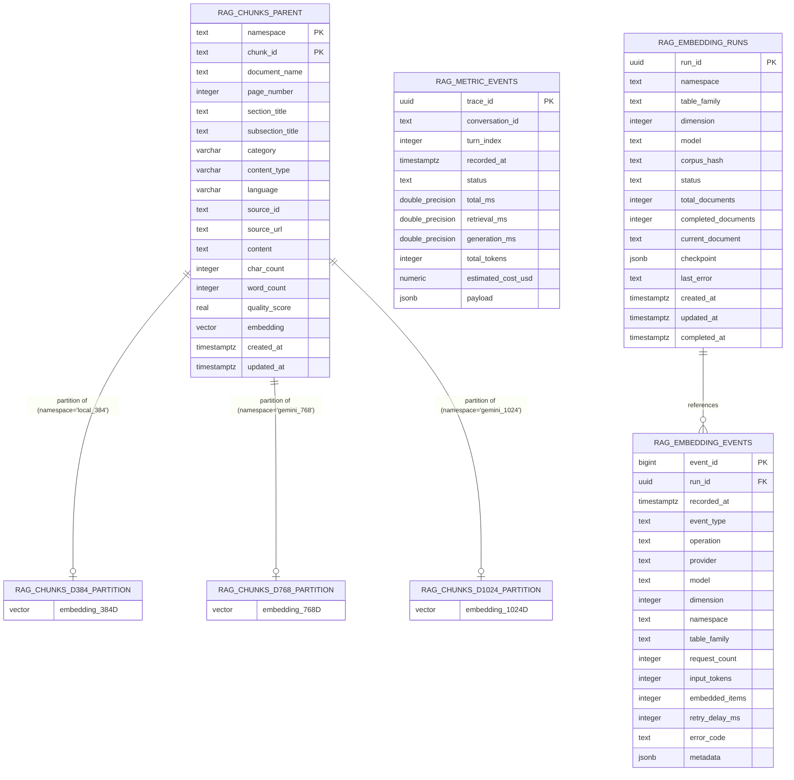

# SugerFree — System Architecture & Technical Design

This document provides a detailed technical explanation of the architecture, components, data flows, and design principles implemented in the **SugerFree** clinical RAG (Retrieval-Augmented Generation) application.

---

## 1. High-Level System Architecture

SugerFree is built with a decoupled architecture containing:
1. **Frontend Layer:** A bilingual production web client (HTML/CSS/JS) and a local Gradio UI for debugging.
2. **API/Orchestration Layer:** Stateless FastAPI endpoints running as serverless functions on Vercel, paired with a python backend pipeline.
3. **Semantic Processing:** Pre-generation safety checks, conversation memory, contextual query rewriters, and domain-specific routers.
4. **Vector Store & Indexing:** A partitioned PostgreSQL 16 database with the `pgvector` extension, running on Neon serverless postgres.
5. **LLM Generation Engine:** Multi-provider API routing (Gemini primary, Groq secondary) with a fallback to purely extractive generation.

---

## 2. Request Lifecycle

The system processes incoming user messages sequentially. The diagram below illustrates the timeline of a query from the time a user types it until the final answer is rendered.

---

## 3. RAG Pipeline & Document Ingestion

SugerFree maintains distinct offline (data ingestion) and online (query/inference) phases to optimize indexing quality and request latencies.

---

## 4. Component Interaction Graph

The components interact in a layered configuration, ensuring that query preprocessing is completed before retrieval, and retrieval is verified before synthesis.

---

## 5. Database & Storage Architecture

SugerFree uses list partitioning in PostgreSQL to separate vector spaces. A separate parent table is used for each dimension to prevent dimension mismatch errors.

### Table Roles
1. **`rag_chunks` Parent Tables:** Store the actual split chunks of document content alongside meta-information (e.g. source URLs, page numbers, quality scores). Partitioned by list using the `namespace` field. HNSW cosine indexes are built on the `embedding` vector column for each partition.
2. **`rag_metric_events` Table:** Persists telemetry data for each RAG pipeline transaction, including processing times, generated responses, estimated token costs, and internal steps for offline diagnostics.
3. **`rag_embedding_runs` & `rag_embedding_events` Tables:** Used by the ingestion pipeline to track batch indexing states, check for errors, and verify token usage against daily limits.

---

## 6. Request Lifecycle — Detailed Technical Explanation

Below is the technical data transformation log for a single query:

### 6.1. User Input & UI Intercept
* **Input:** User query string (e.g. `"ما هي أسباب السكر؟"`) and optional category choice.
* **Component:** `backend/static/index.html` (Browser) or `app.py` (Gradio).
* **Processing:** The UI intercepts the submit event, packs the message alongside browser-retained chat history, and calls the API endpoint.
* **Output:** JSON request payload matching the `ChatRequest` schema.

### 6.2. Endpoint Validation & Staging
* **Input:** `ChatRequest` model.
* **Component:** `backend/server.py` (`POST /api/chat/stages`).
* **Processing:** Validates the message size, sanitizes the category route, and resolves the requested vector dimension. It constructs a `ConversationMemory` instance and calls `src/evidence_service.py:stage_evidence`.
* **Output:** `RetrievalEnvelope` containing evidence status and metadata.

### 6.3. Pre-generation Intercepts
* **Input:** Raw query string.
* **Component:** `src/safety.py:classify_safety`, `src/rewriter.py:rewrite_query`, and `src/router.py:route_query`.
* **Processing:** 
  1. `classify_safety` uses keyword heuristics to match Arabic/English medical emergency signals. If matched, it returns `SafetyLevel.EMERGENCY` and halts execution.
  2. `rewrite_query` resolves conversational pronouns (using history) and adds bilingual retrieval hints mapping Arabic expressions to English terms.
  3. `route_query` scores the query against category keyword lists to return `treatment`, `prevention`, `nutrition`, or `general`.
* **Output:** Safe, expanded search query and active search category.

### 6.4. Embedding & Search
* **Input:** Rewritten query string.
* **Component:** `src/embeddings.py` (via `EmbeddingModel`) and `src/vector_store.py` (via `VectorStore`).
* **Processing:** Resolves the active model (local `paraphrase-multilingual-MiniLM-L12-v2` or cloud `gemini-embedding-2`), vectorizes the query, and performs a cosine-distance search (`<=>` operator) on the database partition. If the embedding provider fails, it triggers the lexical keyword SQL fallback.
* **Output:** A list of raw document chunk dictionary records.

### 6.5. Thresholding & Sufficiency Verification
* **Input:** Raw search results with cosine distance values.
* **Component:** `src/retriever.py:retrieve` & `is_retrieval_sufficient`.
* **Processing:** Converts cosine distance to similarity score: `score = 1.0 - distance`. Drops chunks with scores below `SIMILARITY_THRESHOLD` (0.30) and removes chunks representing bibliographies. If the highest score is below `0.25`, the query is flagged as unanswerable.
* **Output:** Verified list of `RetrievedChunk` objects, or an empty list if insufficient.

### 6.6. Prompts & LLM Generation
* **Input:** `RetrievedChunk` elements and conversation history.
* **Component:** `src/prompts.py` and `src/generator.py`.
* **Processing:** If the retrieval is sufficient, `build_user_prompt` constructs the LLM context, labeling retrieved texts as `SOURCE 1`, `SOURCE 2`, etc. System instructions explicitly forbid generating claims not contained in the sources. The generator sends this prompt to the active model (`gemini-3.6-flash`). If rate-limited, it falls back to Groq, and then to extractive excerpts.
* **Output:** Grounded answer string.

### 6.7. Citation Reconstruction & Telemetry Logging
* **Input:** LLM generated text, retrieved chunks, and pipeline timers.
* **Component:** `src/citations.py:ensure_inline_citations`, `src/safety.py:get_disclaimer`, and `src/observability.py:record_trace`.
* **Processing:** Formats inline markers to match retrieved database attributes, appends the appropriate medical disclaimer based on the safety level, estimates token costs, and saves the event metrics payload into `rag_metric_events`.
* **Output:** Complete JSON payload (`ChatResponse`) returned to the user interface.

---

## 7. Code-to-Architecture Mapping

| Architectural Component | File / Path | Responsibility |
| :--- | :--- | :--- |
| **API Server & Routing** | [backend/server.py](file:///d:/CREATIVA%20RAG%20PROJECT%20-%20SugerFree/Creativa_Diabetes/backend/server.py) | Defines the stateless serverless HTTP interface, request validation, and Vercel-compatible routers. |
| **Local Orchestrator** | [app.py](file:///d:/CREATIVA%20RAG%20PROJECT%20-%20SugerFree/Creativa_Diabetes/app.py) | Handles Gradio interface rendering, pipeline orchestration, and debug panels. |
| **Ingestion Entrypoint** | [scripts/ingest.py](file:///d:/CREATIVA%20RAG%20PROJECT%20-%20SugerFree/Creativa_Diabetes/scripts/ingest.py) | Manages corpus reading, force updates, database index verification, and chunk ingestion commands. |
| **Ingestion Pipeline** | [src/ingestion/pipeline.py](file:///d:/CREATIVA%20RAG%20PROJECT%20-%20SugerFree/Creativa_Diabetes/src/ingestion/pipeline.py) | Coordinates document parsing, page context propagation, quality filtration, embedding, and storage. |
| **PDF/Docx Parsing** | [src/ingestion/parser.py](file:///d:/CREATIVA%20RAG%20PROJECT%20-%20SugerFree/Creativa_Diabetes/src/ingestion/parser.py) | Extracts elements from source files. Uses PyMuPDF, python-docx, and Tesseract OCR for scanned images. |
| **Quality Filtering** | [src/ingestion/core/quality_filter.py](file:///d:/CREATIVA%20RAG%20PROJECT%20-%20SugerFree/Creativa_Diabetes/src/ingestion/core/quality_filter.py) | Scores chunk text density, filters out OCR noise, numbers-only blocks, and short header fragments. |
| **Text Chunking** | [src/ingestion/core/chunker.py](file:///d:/CREATIVA%20RAG%20PROJECT%20-%20SugerFree/Creativa_Diabetes/src/ingestion/core/chunker.py) | Splits parsed documents into size-bounded chunks while preserving monolithic markdown tables. |
| **Vector Database Client** | [src/vector_store.py](file:///d:/CREATIVA%20RAG%20PROJECT%20-%20SugerFree/Creativa_Diabetes/src/vector_store.py) | Manages connection pooling, index schema initialization, partition creation, and nearest-neighbor search. |
| **Embedding Facade** | [src/embeddings.py](file:///d:/CREATIVA%20RAG%20PROJECT%20-%20SugerFree/Creativa_Diabetes/src/embeddings.py) | Wraps local sentence-transformers and Gemini APIs, ensuring unit-length vectors are used for cosine search. |
| **Quota Controller** | [src/embedding_quota.py](file:///d:/CREATIVA%20RAG%20PROJECT%20-%20SugerFree/Creativa_Diabetes/src/embedding_quota.py) | Throttles ingestion requests to prevent rate limit exceptions, tracking RPM/TPM against constraints. |
| **Retrieval Filtering** | [src/retriever.py](file:///d:/CREATIVA%20RAG%20PROJECT%20-%20SugerFree/Creativa_Diabetes/src/retriever.py) | Applies similarity thresholds, category filters, and ignores bibliography sections. |
| **Safety Classifier** | [src/safety.py](file:///d:/CREATIVA%20RAG%20PROJECT%20-%20SugerFree/Creativa_Diabetes/src/safety.py) | Inspects queries for emergency or high-risk signals, managing disclaimers and bypass routing. |
| **Query Rewriter** | [src/rewriter.py](file:///d:/CREATIVA%20RAG%20PROJECT%20-%20SugerFree/Creativa_Diabetes/src/rewriter.py) | Resolves conversational context using history and adds translation hints for Arabic query retrieval. |
| **Category Router** | [src/router.py](file:///d:/CREATIVA%20RAG%20PROJECT%20-%20SugerFree/Creativa_Diabetes/src/router.py) | Matches queries to domain categories (treatment/prevention/nutrition) using keyword scoring. |
| **Prompt Construction** | [src/prompts.py](file:///d:/CREATIVA%20RAG%20PROJECT%20-%20SugerFree/Creativa_Diabetes/src/prompts.py) | Structures the grounded LLM system context, inserting history and formatted context chunks. |
| **Inference Client** | [src/generator.py](file:///d:/CREATIVA%20RAG%20PROJECT%20-%20SugerFree/Creativa_Diabetes/src/generator.py) | Manages primary (Gemini) and fallback (Groq) generative LLM calls, implementing retry logic. |
| **Extractive Answer Fallback** | [src/extractive.py](file:///d:/CREATIVA%20RAG%20PROJECT%20-%20SugerFree/Creativa_Diabetes/src/extractive.py) | Acts as a tertiary generation fallback, directly building answer summaries from retrieved texts. |
| **Citation Formatter** | [src/citations.py](file:///d:/CREATIVA%20RAG%20PROJECT%20-%20SugerFree/Creativa_Diabetes/src/citations.py) | Matches generated inline tags to verified database attributes, outputting clickable metadata links. |
| **Telemetry System** | [src/observability.py](file:///d:/CREATIVA%20RAG%20PROJECT%20-%20SugerFree/Creativa_Diabetes/src/observability.py) | Records latency breakdowns and saves event metrics to `rag_metric_events` for analysis. |
